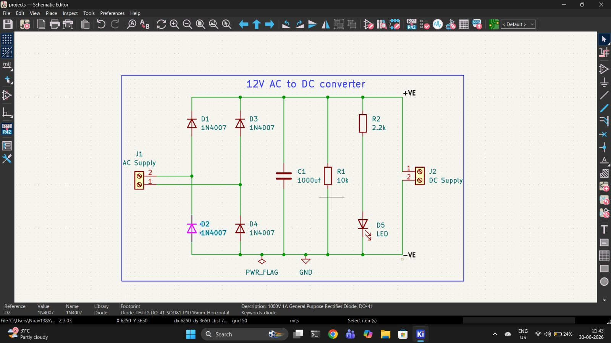
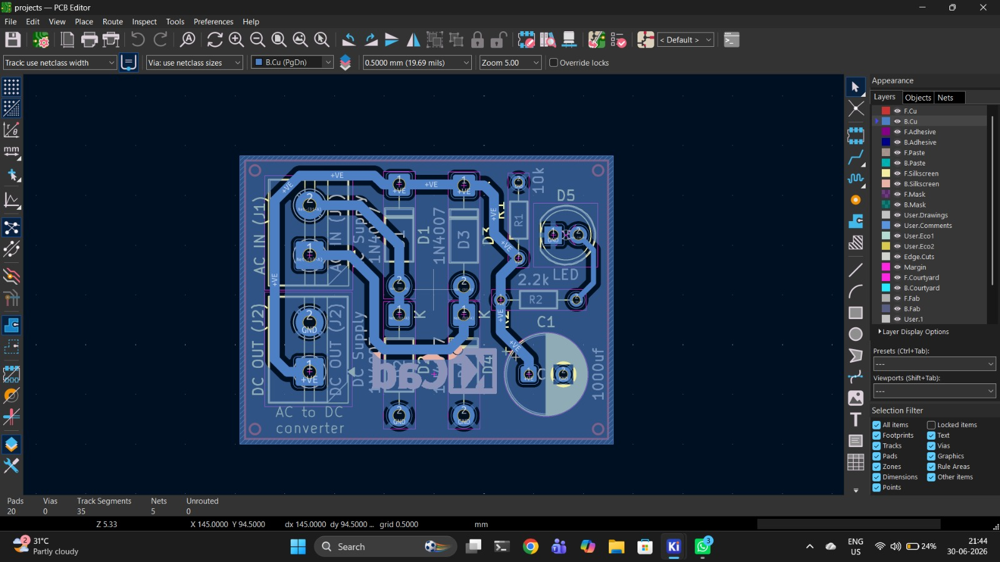
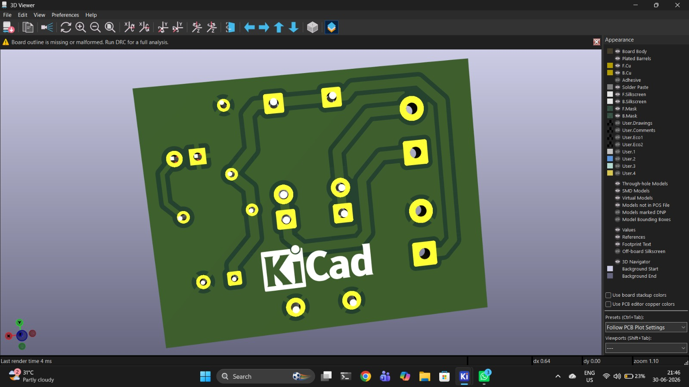

# ⚡ 12V AC to DC Converter — Full Bridge Rectifier PCB

A compact, through-hole **12V AC to DC converter** PCB designed in **KiCad 10.0**. This project converts 12V AC input into smooth DC output using a full-bridge rectifier with filtering, and includes a power indicator LED.

## 📸 Project Photos

### Schematic Diagram


### PCB Layout


### 3D View of PCB


---

## 📋 Table of Contents

- [Project Photos](#-project-photos)
- [Features](#-features)
- [Circuit Description](#-circuit-description)
- [Schematic Overview](#-schematic-overview)
- [Bill of Materials (BOM)](#-bill-of-materials-bom)
- [PCB Details](#-pcb-details)
- [How It Works](#-how-it-works)
- [Getting Started](#-getting-started)
- [Manufacturing](#-manufacturing)
- [Safety Warning](#%EF%B8%8F-safety-warning)
- [License](#-license)

---

## ✨ Features

- 🔌 **Full-bridge rectifier** using 4x 1N4007 diodes for efficient AC to DC conversion
- 🔋 **1000µF electrolytic capacitor** for smooth, ripple-free DC output
- 💡 **LED power indicator** with current-limiting resistor — know at a glance when the circuit is ON
- 🔩 **Screw terminal connectors** for easy and secure wire connections (both AC input & DC output)
- 📐 **Compact through-hole (THT) design** — easy to solder by hand, beginner-friendly
- 📦 **Gerber files included** — ready for PCB fabrication
- 🛠️ **Designed in KiCad 10.0** — fully open-source EDA tool

---

## 🔍 Circuit Description

This is a classic **unregulated AC to DC power supply** circuit. It takes a 12V AC input (typically from a step-down transformer) and converts it to approximately **~15-17V DC** (peak voltage minus diode drops) using a full-bridge rectifier.


---

## 📐 Schematic Overview

The circuit consists of the following stages:

### 1. AC Input Stage
- **J1** — Screw Terminal (2-pin) for 12V AC input from a transformer

### 2. Full-Bridge Rectifier
- **D1, D2, D3, D4** — 1N4007 (1000V, 1A) rectifier diodes arranged in a bridge configuration
- Converts both halves of the AC waveform into pulsating DC

### 3. Filtering Stage
- **C1** — 1000µF electrolytic capacitor
- Smooths the pulsating DC into a nearly constant DC voltage
- Reduces output ripple significantly

### 4. Bleeder/Discharge Resistor
- **R1** — 10kΩ resistor connected across the output
- Safely discharges the capacitor when the circuit is turned off
- Provides a minimum load for stability

### 5. Power Indicator
- **R2** — 2.2kΩ current-limiting resistor
- **D5** — LED (5mm, through-hole)
- Indicates that DC power is present at the output

### 6. DC Output Stage
- **J2** — Screw Terminal (2-pin) for DC output (+VE and -VE)

---

## 📦 Bill of Materials (BOM)

| Ref | Component | Value | Package/Footprint | Qty | Description |
|-----|-----------|-------|--------------------|-----|-------------|
| D1, D2, D3, D4 | 1N4007 | - | DO-41 (THT) | 4 | 1000V 1A General Purpose Rectifier Diode |
| D5 | LED | - | 5mm THT | 1 | Power Indicator LED |
| C1 | Electrolytic Capacitor | 1000µF | Radial D8.0mm P3.50mm | 1 | Filtering/Smoothing Capacitor |
| R1 | Resistor | 10kΩ | Axial DIN0204 (THT) | 1 | Bleeder/Discharge Resistor |
| R2 | Resistor | 2.2kΩ | Axial DIN0204 (THT) | 1 | LED Current-Limiting Resistor |
| J1 | Screw Terminal | 2-pin | MaiXu MX126 5.0mm pitch | 1 | AC Input Connector |
| J2 | Screw Terminal | 2-pin | MaiXu MX126 5.0mm pitch | 1 | DC Output Connector |

**Total Components: 9**

---

## 🖥️ PCB Details

| Parameter | Details |
|-----------|---------|
| **EDA Tool** | KiCad 10.0 |
| **Layers** | 1-layer (Front Copper) |
| **Components** | All Through-Hole (THT) |
| **Connectors** | Screw Terminals (5.0mm pitch) |
| **Solder Mask** | Both sides |
| **Silkscreen** | Both sides |

---

## ⚙️ How It Works

```
AC Input (12V AC)
      │
      ▼
┌──────────────┐
│   During positive half cycle:
│   Current flows: J1 Pin1 → D1 → +VE rail → Load → -VE rail → D4 → J1 Pin2
│
│   During negative half cycle:
│   Current flows: J1 Pin2 → D3 → +VE rail → Load → -VE rail → D2 → J1 Pin1
│
│   Result: Full-wave rectified pulsating DC
└──────────────┘
      │
      ▼
┌──────────────┐
│   C1 (1000µF) charges during voltage peaks and
│   discharges during valleys, smoothing the output
└──────────────┘
      │
      ▼
┌──────────────┐
│   R1 (10kΩ) provides a safe discharge path
│   R2 (2.2kΩ) + LED indicates power status
└──────────────┘
      │
      ▼
  DC Output (~15-17V DC)
```

### Output Voltage Calculation

```
V_out (peak) = V_ac(peak) - 2 × V_diode
             = (12 × √2) - (2 × 0.7)
             = 16.97 - 1.4
             ≈ 15.6V DC (peak)
```

### LED Current Calculation

```
I_LED = (V_out - V_LED) / R2
      = (15.6 - 2.0) / 2200
      ≈ 6.2 mA (safe operating current for LED)
```

---

## 🚀 Getting Started

### Prerequisites

- [KiCad 10.0](https://www.kicad.org/) or later (to open and edit the schematic/PCB files)

### Project Files

```
ac_to_dc_converter/
├── 📄 ac_to_dc_converter.kicad_pro    # KiCad project file
├── 📄 ac_to_dc_converter.kicad_sch    # Schematic file
├── 📄 ac_to_dc_converter.kicad_pcb    # PCB layout file
├── 📁 Gerber/                          # Manufacturing files (ready to fab)
│   ├── ac_to_dc_converter-F_Cu.gbr        # Front copper layer
│   ├── ac_to_dc_converter-B_Cu.gbr        # Back copper layer
│   ├── ac_to_dc_converter-F_Mask.gbr      # Front solder mask
│   ├── ac_to_dc_converter-B_Mask.gbr      # Back solder mask
│   ├── ac_to_dc_converter-F_Paste.gbr     # Front paste layer
│   ├── ac_to_dc_converter-B_Paste.gbr     # Back paste layer
│   ├── ac_to_dc_converter-F_Silkscreen.gbr# Front silkscreen
│   ├── ac_to_dc_converter-B_Silkscreen.gbr# Back silkscreen
│   ├── ac_to_dc_converter-Edge_Cuts.gbr   # Board outline
│   ├── ac_to_dc_converter-PTH.drl         # Plated through-holes drill
│   ├── ac_to_dc_converter-NPTH.drl        # Non-plated through-holes drill
│   └── ac_to_dc_converter-job.gbrjob      # Gerber job file
└── 📄 README.md                        # This file
```

### Opening the Project

1. Download or clone this repository
2. Open KiCad 10.0
3. Go to **File → Open Project**
4. Navigate to the project folder and select `ac_to_dc_converter.kicad_pro`

---

## 🏭 Manufacturing

The **Gerber files** are pre-generated and located in the `Gerber/` folder. You can directly upload the Gerber folder (as a ZIP) to any PCB manufacturer:

- [JLCPCB](https://jlcpcb.com/)
- [PCBWay](https://www.pcbway.com/)
- [OSH Park](https://oshpark.com/)
- [Seeed Studio Fusion](https://www.seeedstudio.com/fusion.html)

### Steps to Order:
1. Compress the `Gerber/` folder into a `.zip` file
2. Upload to your preferred PCB manufacturer's website
3. Select your desired options (color, quantity, thickness, etc.)
4. Place the order and wait for delivery! 🎉

---

## ⚠️ Safety Warning

> **⚡ CAUTION: This circuit deals with AC mains power (through a transformer). Always exercise proper safety precautions.**

- ❌ **DO NOT** connect this circuit directly to mains AC (220V/110V) — always use a proper step-down transformer
- ✅ Use a **12V AC transformer** as the input source
- 🔌 Always disconnect power before making any changes to the circuit
- 🛡️ This is an **unregulated** power supply — output voltage may vary with load
- 💡 For regulated output, consider adding a voltage regulator (e.g., LM7812 for 12V DC or LM7805 for 5V DC)
- 🔥 Ensure proper ventilation and do not exceed component ratings

---

## 🔧 Possible Improvements

- [ ] Add a **voltage regulator** (LM7812/LM7805) for stable regulated output
- [ ] Add **input fuse** for overcurrent protection
- [ ] Add **TVS diode** or **MOV** for surge protection
- [ ] Replace with **polarized capacitor symbol** for clarity
- [ ] Add **heat sink** provisions for high-current applications
- [ ] Design an **SMD version** for compact form factor

---

## 👨‍💻 Author

**Nirav Jain** — Designed with ❤️ using KiCad

---

## 📄 License

This project is open-source. Feel free to use, modify, and distribute.

---

<p align="center">
  <b>⭐ If you found this project helpful, please give it a star! ⭐</b>
</p>
